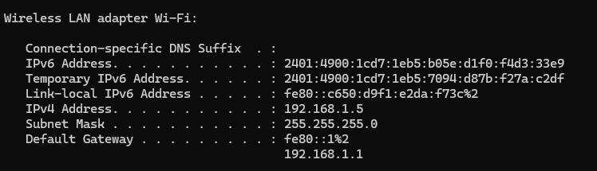
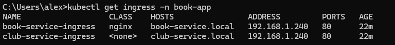
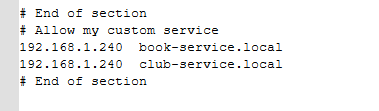

# Create kubernetes cluster with kind (Single Node)

## Go to spring boot project and build the docker image
```bash
.\mvnw clean install -DskipTests jib:build -X
```

``` bash
kind create cluster --name=book-club-cluster
kind delete cluster --name book-club-cluster
kind get clusters
```
## Check current cluster connect with kubectl
```bash
kubectl config current-context
kubectl cluster-info --context kind-book-club-cluster
```
## Navigate to kubernetes cluster as our namespace is book-app
```bash
kubectl apply -R -f .
kubectl get pods -n book-app  
```
## Get pod descripstion
```bash
kubectl describe pod <pod-name> -n book-app
kubectl logs <pod-name> -n book-app

kubectl describe pod book-service-db-57d9df6b -n book-app
kubectl logs book-service-db-57d9df6b-fzg8r -n book-app
```
## Install ingress-nginx controller and edit svc config from LoadBalancer to NodePort
```bash
kubectl apply -f https://raw.githubusercontent.com/kubernetes/ingress-nginx/controller-v1.10.1/deploy/static/provider/cloud/deploy.yaml
kubectl edit svc ingress-nginx-controller -n ingress-nginx
```
## Install MetalLB load balancer
```bash
kubectl apply -f https://raw.githubusercontent.com/metallb/metallb/v0.13.10/config/manifests/metallb-native.yaml
```

What happens here?
Kubernetes asks the cloud provider or load balancer (here MetalLB) to assign an external IP to that service.
MetalLB watches for these LoadBalancer services and assigns an IP address from the IP pool you configured.
Your service then becomes reachable on that external IP.

```shell
delete prev running ingress
kubectl delete pods --all -n book-app
kubectl delete deployment --all -n book-app
kubectl delete svc --all -n book-app 
kubectl delete ingress --all -n book-app
kubectl delete namespace book-app
kubectl -n metallb-system delete pod -l app=metallb
kubectl delete svc ingress-nginx-controller -n ingress-nginx
```

```shell
kubectl get svc -n ingress-nginx
kubectl get ingress -n book-app
kubectl describe ingress book-service-ingress -n book-app
kubectl logs -n ingress-nginx -l app.kubernetes.io/name=ingress-nginx
```



C:\Windows\System32\drivers\etc\hosts

---
Use Lens IDE (Desktop App)